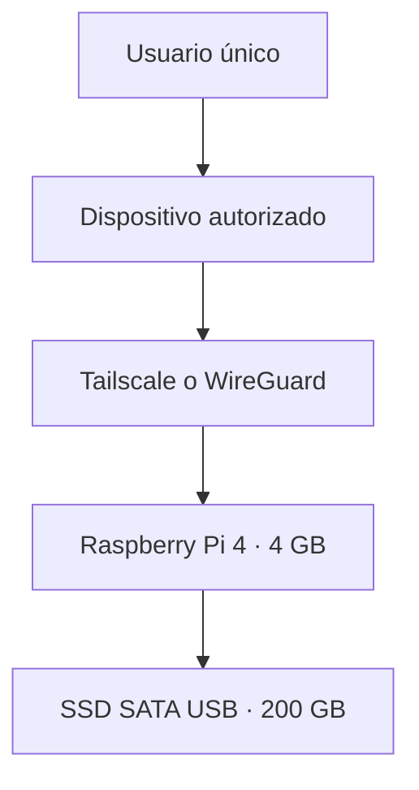
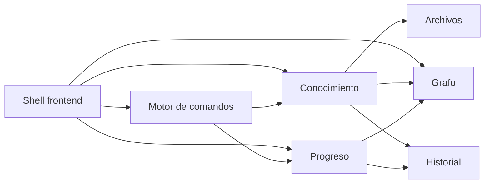

# 01 — Visión general del sistema

## Objetivo arquitectónico

Mantener conocimiento y progreso en un único sistema transaccional. La conexión no es una sincronización entre «Notas» y «Estadísticas»: ambos son módulos del mismo dominio y consumen las mismas entidades, acciones y eventos.

## Contexto



- La aplicación es web y desktop-first.
- No funciona sin conexión con la Raspberry Pi.
- El MVP no tiene autenticación propia; la red privada es la frontera de acceso.
- El SSD contiene aplicación, SQLite, adjuntos, papelera y snapshots locales.

## Componentes ejecutables

| Componente | Responsabilidad |
| --- | --- |
| Cliente React/Vite | Shell, editor, grafo, progreso, comandos y estado de interacción. |
| Servidor Fastify | API, validación, servicios de aplicación, transacciones y entrega del cliente. |
| SQLite | Estado actual, revisiones, relaciones e historial. |
| Raíz de adjuntos | Contenido binario administrado y referenciado por ID. |
| Operación del host | Proceso, red privada, reloj, logs, snapshots y actualizaciones. |

## Módulos lógicos



El grafo y las estadísticas son proyecciones de lectura. No poseen bases de datos paralelas ni mecanismos de sincronización propios.

## Flujo de escritura

```text
Interacción UI o comando
  → ActionEnvelope tipado
  → endpoint de acciones
  → validación sintáctica y de dominio
  → servicio de aplicación
  → transacción SQLite
      1. actualizar estado
      2. insertar evento histórico
  → resultado y versiones actualizadas
  → invalidar/refrescar proyecciones afectadas
```

## Reglas de dependencia

1. Los componentes visuales no escriben directamente en cachés ni entidades.
2. El motor de comandos no contiene reglas de negocio; produce acciones tipadas.
3. Los servicios de aplicación coordinan repositorios y dominio.
4. Las reglas de progreso no dependen de React, Fastify ni SQLite.
5. Los repositorios encapsulan SQL y rutas de archivos.
6. Un módulo consulta a otro mediante contratos de aplicación, no accediendo a sus tablas desde la UI.
7. El historial se inserta en la misma transacción que la mutación que describe.

## Estrategia de lectura

- Consultas separadas de las acciones de escritura.
- Respuestas orientadas a cada superficie: Inicio, explorador, grafo, editor, progreso e historial.
- Paginación o virtualización para árboles e historiales extensos.
- Expansión del grafo por vecindad y profundidad, nunca carga total predeterminada.

No se requiere event sourcing completo: las tablas de estado actual siguen siendo la fuente operativa y el registro de eventos proporciona auditoría e historial.

## Fallos esperados

| Fallo | Respuesta obligatoria |
| --- | --- |
| Raspberry Pi inaccesible | Mostrar desconexión y bloquear mutaciones. |
| SSD lleno | Rechazar antes de crear estado parcial. |
| Acción repetida por reintento | Devolver el resultado idempotente, sin duplicar eventos. |
| Conflicto de versión | Rechazar con estado actual y opción de reintento consciente. |
| Markdown estructurado inválido | No guardar parcialmente; señalar el fragmento. |
| Archivo perdido | Mantener el registro, marcar adjunto ausente y ofrecer reparación. |
| Reloj incorrecto | Advertir; no reescribir fechas históricas automáticamente. |

## Consecuencia principal

La aplicación debe poder crecer por módulos sin distribuirse. Separar contratos ahora permite extraer procesos en el futuro, pero el MVP favorece consistencia, operación sencilla y bajo consumo de recursos.
