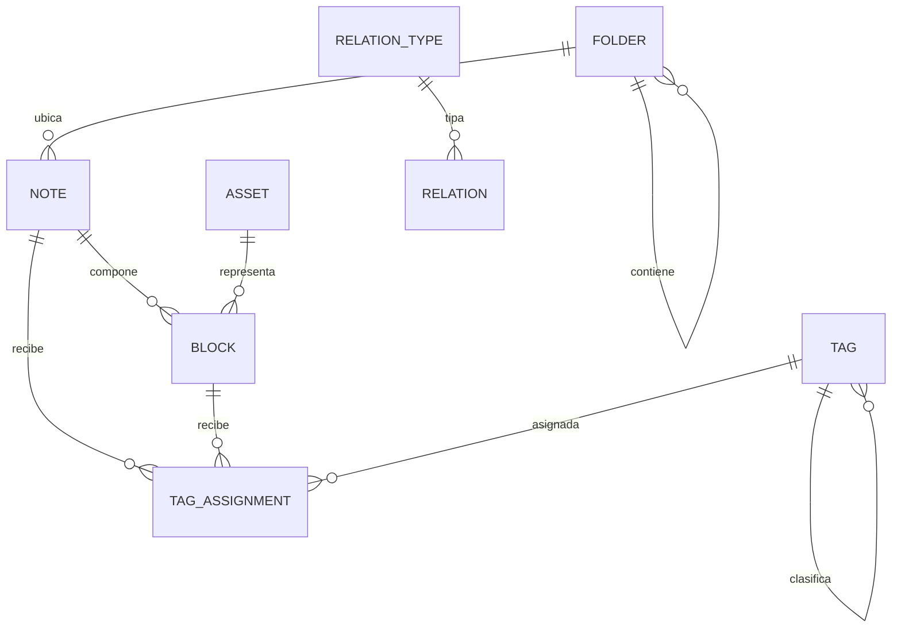
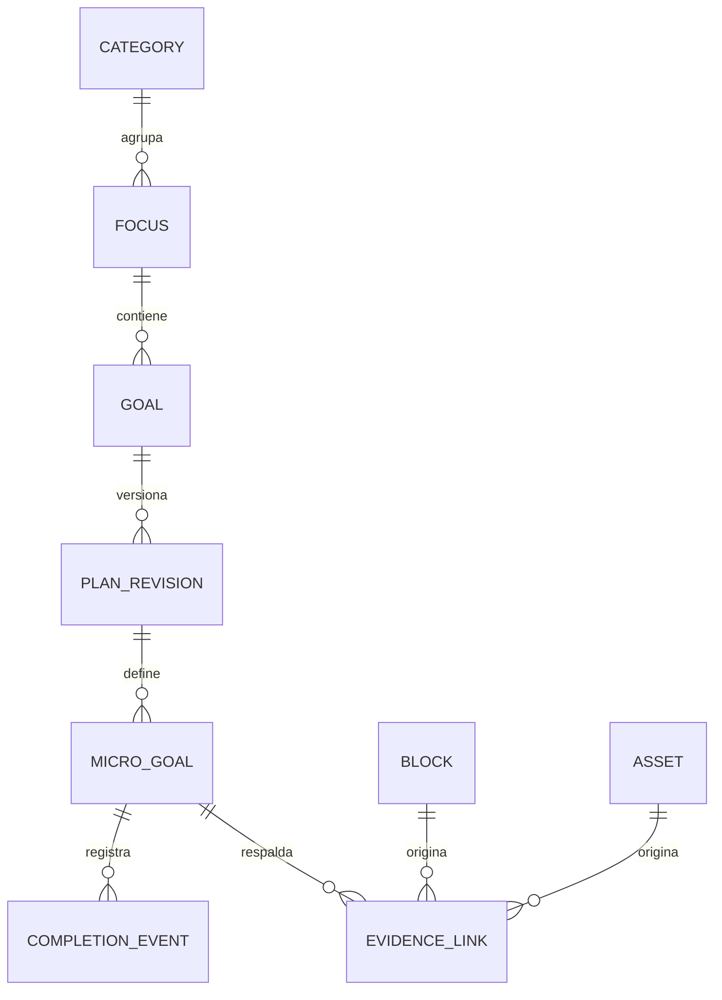
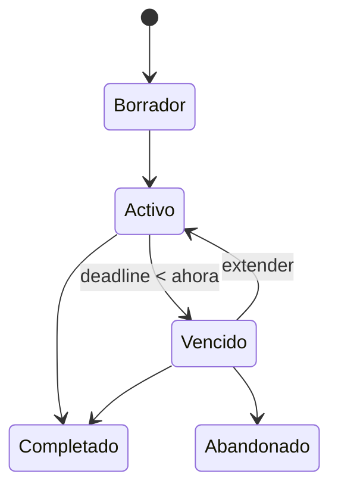

# 02 — Modelo de dominio

## Áreas del dominio

| Área | Responsabilidad |
| --- | --- |
| Conocimiento | Notas, bloques, carpetas, etiquetas y adjuntos. |
| Relaciones | Tipos y conexiones entre notas, bloques, metas y micro-metas. |
| Progreso | Categorías, focos, metas, revisiones, micro-metas y finalizaciones. |
| Historial | Eventos append-only, restauración y trazabilidad. |

## Identidad y concurrencia

- Toda entidad tiene un ID opaco y estable.
- El formato exacto del ID queda como decisión de implementación; no aparece como semántica de producto.
- Entidades editables incorporan una versión para detectar escrituras sobre estado obsoleto.
- Los nombres son etiquetas humanas y pueden cambiar; nunca sustituyen al ID en relaciones internas.

## Modelo de conocimiento



### Invariantes

- Una nota pertenece como máximo a una carpeta.
- Una carpeta tiene como máximo un padre y no puede ser ancestro de sí misma.
- Una etiqueta tiene como máximo un padre y no admite ciclos.
- Un bloque pertenece exactamente a una nota y ocupa una posición estable dentro de ella.
- Una nota o bloque puede recibir múltiples etiquetas.
- Un `Asset` solo apunta a una ruta dentro de la raíz administrada.

## Modelo de progreso



### Categorías

`FISICO`, `MENTAL`, `OCUPACIONAL` y `EXPRESIVO` son valores cerrados en el MVP. No se comparan mediante una puntuación global.

### Foco principal

- Solo puede existir un foco principal activo.
- Pertenece a una única categoría.
- Contiene una o varias metas.
- Tiene una frase resumida y una fecha/hora límite absoluta.

### Metas y revisiones

- Cada meta obtiene sus micro-metas de una `PlanRevision` inmutable.
- Modificar el conjunto activo crea una revisión nueva después de mostrar el impacto porcentual.
- Las finalizaciones permanecen asociadas a IDs de micro-meta; la creación de una revisión debe definir explícitamente cuáles continúan, cuáles se retiran y cuáles nacen.

## Cálculo

```text
progreso_meta = completadas_en_revision_activa / total_en_revision_activa
progreso_foco = promedio(progreso_meta de metas con revisión válida)
```

- Todas las micro-metas pesan lo mismo dentro de su meta.
- Una meta sin micro-metas no participa en el promedio y se muestra como incompleta de configurar.
- Evidencias y relaciones no cambian porcentajes.
- Completar o reabrir una micro-meta sí cambia la proyección de progreso.

## Relaciones semánticas

Una relación contiene origen, destino, tipo, autoría temporal y estado de eliminación. El origen y destino pueden ser nota, bloque, meta o micro-meta.

| Tipo MVP | Dirección |
| --- | --- |
| `relacionado-con` | Bidireccional. |
| `referencia` | Hacia el contenido citado. |
| `continúa` | Hacia el contenido continuado. |
| `depende-de` | Hacia la dependencia. |
| `respalda` | Hacia la afirmación respaldada. |
| `contradice` | Hacia el contenido contradicho. |
| `ejemplo-de` | Hacia el concepto ejemplificado. |
| `evidencia-para` | Hacia la meta o micro-meta respaldada. |

Los tipos personalizados pertenecen a una versión posterior. El grafo semántico admite ciclos; las jerarquías de carpetas y etiquetas no usan este mecanismo.

## Estados del foco



`Vencido` es una condición derivada del reloj y la fecha límite. No implica fracaso automático ni una escritura por el mero paso del tiempo.

## Eventos mínimos

- `NoteCreated`, `NoteMoved`, `NoteDeleted`, `NoteRestored`.
- `BlockCreated`, `BlockUpdated`, `BlockDeleted`, `BlockRestored`.
- `TagAssigned`, `TagRemoved`.
- `RelationCreated`, `RelationDeleted`.
- `AssetAttached`, `AssetMoved`, `AssetMissing`.
- `FocusActivated`, `FocusDeadlineExtended`, `FocusCompleted`, `FocusAbandoned`.
- `PlanRevisionCreated`.
- `MicroGoalCompleted`, `MicroGoalReopened`.
- `EvidenceLinked`, `EvidenceUnlinked`.

Los nombres finales son contratos de código y pueden ajustarse antes de implementarse; su significado y granularidad no deben fusionar acciones distintas.

## Eliminación

- Las entidades recuperables usan eliminación lógica.
- Restaurar conserva el ID.
- Eliminar contenido no borra eventos históricos.
- Si una relación ya no puede resolverse, se conserva como referencia histórica y se marca su destino como ausente.
