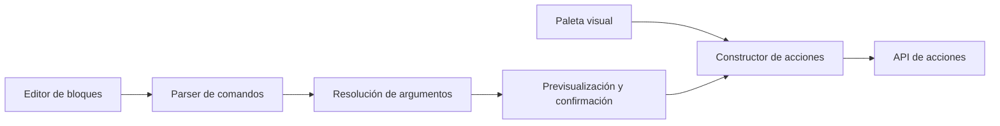

# 05 — Motor de comandos

## Objetivo

Ofrecer una ruta rápida para operar el producto sin crear un segundo sistema de automatización. Un comando traduce intención escrita a una acción tipada; no ejecuta SQL, JavaScript, shell ni lógica arbitraria.

## Posición en la arquitectura



La paleta visual y el texto `/` convergen en el mismo constructor. El motor termina cuando produce un `ActionEnvelope`; las reglas de negocio viven en el backend.

## Ciclo de vida

1. El usuario escribe `/` en un bloque activo o abre la paleta.
2. El cliente muestra comandos válidos según el contexto.
3. El parser crea una representación estructurada incompleta.
4. El resolver busca carpetas, etiquetas, notas, metas o micro-metas mencionadas.
5. Si existe ambigüedad, la UI exige elegir un ID concreto.
6. Se muestra una previsualización para acciones con impacto estructural.
7. La confirmación despacha la acción.
8. El texto temporal se reemplaza por un bloque estructurado o una confirmación reversible.

## Gramática conceptual

```text
/<namespace> <verb> [target] [--option value]
```

Namespaces del MVP:

| Namespace | Operaciones iniciales |
| --- | --- |
| `/note` | `create`, `move`. |
| `/tag` | `add`, `remove`. |
| `/rel` | `link`, `unlink`. |
| `/goal` | `link`. |
| `/micro` | `create`, `complete`, `reopen`. |
| `/evidence` | `link`, `unlink`. |
| `/focus` | `set`. |
| `/view` | `graph`, `folders`, `expand`, `collapse`, `focus`. |
| `/file` | `attach`. |

Las menciones usan una forma legible como `[[Press banca]]`, pero se resuelven a IDs antes de ejecutar.

## Seguridad de ejecución

- Solo el bloque de entrada activo reconoce comandos.
- Pegar texto nunca confirma una acción.
- Un bloque de código desactiva interpretación de comandos.
- Abrir, importar, renderizar o sincronizar Markdown nunca ejecuta comandos.
- El backend acepta acciones conocidas mediante un discriminante cerrado; no evalúa texto del usuario.
- Las acciones destructivas o que recalculan progreso muestran su impacto antes de confirmarse.
- Un reintento conserva `actionId` para no duplicar el evento.

## Transformación visual

Después de ejecutar, el comando no queda como una instrucción pendiente. Ejemplo:

```text
/micro complete [[Press banca 120 kg]]
```

se convierte en una representación vinculada al resultado:

```text
✓ Press banca 120 kg
Completada el 4 sep 2026 · evidencia opcional
```

La representación conserva el ID de la entidad y del evento, no el comando como mecanismo reejecutable.

## Paridad con UI

Cada operación tiene una única definición de acción. Deben existir pruebas de contrato que creen la acción desde:

1. El componente visual.
2. El parser de comandos.

Las dos representaciones serializadas deben ser equivalentes salvo por metadatos de origen no semánticos.

## Deshacer

- Una acción reversible ofrece una ventana de deshacer desde la UI.
- Deshacer despacha otra acción; no elimina el evento original.
- Reabrir una micro-meta genera `MicroGoalReopened`.
- Restaurar desde la papelera conserva el ID original.
- Acciones no reversibles requieren confirmación reforzada y deben ser excepcionales en el MVP.

## Errores de usuario

| Situación | Comportamiento |
| --- | --- |
| Comando desconocido | Sugerir coincidencias sin ejecutar. |
| Argumento faltante | Mantener la paleta abierta y solicitarlo. |
| Referencia ambigua | Mostrar candidatos con contexto. |
| Entidad eliminada | Ofrecer buscar otra o abrir la papelera. |
| Conflicto de versión | Mostrar estado actual y reconstruir la previsualización. |
| Desconexión | Conservar texto no ejecutado; bloquear confirmación. |

Conservar texto no ejecutado no constituye edición offline: permanece como estado temporal del editor y no se presenta como guardado.
