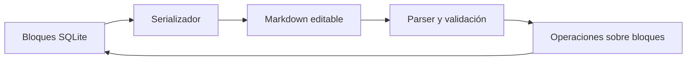

# 07 — Módulo de conocimiento

## Propósito

Capturar conocimiento en bloques estables y permitir verlo mediante carpetas, etiquetas, Markdown y relaciones sin duplicar los datos.

## Agregado de nota

Una nota contiene:

- ID estable.
- Título.
- Carpeta opcional.
- Metadatos de creación, modificación, versión y eliminación.
- Secuencia ordenada de bloques.

Tipos iniciales de bloque:

- Texto o párrafo.
- Encabezado.
- Lista.
- Código.
- Enlace.
- Imagen.
- Archivo.
- Referencia estructurada a nota, meta o micro-meta.
- Resultado estructurado de una acción.

Cada bloque tiene identidad propia para recibir etiquetas, relaciones y evidencias.

## Edición visual

- La interacción principal es un editor de bloques.
- Los atajos Markdown aceleran la creación de estructuras comunes.
- Imágenes y archivos se insertan mediante selector, comando o arrastre.
- Reordenar bloques actualiza posiciones dentro de una sola acción.
- El guardado debe ser transaccional a nivel de la operación aplicada, no depender de reescribir toda la nota como texto opaco.

La librería concreta del editor permanece abierta y debe evaluarse por soporte de bloques con IDs, extensiones, accesibilidad y serialización controlable.

## Proyección Markdown

SQLite sigue siendo la fuente de verdad. El modo fuente serializa bloques a Markdown editable y vuelve a analizarlos antes de guardar.



### Reglas

- Bloques comunes usan Markdown normal.
- Componentes estructurados usan sintaxis protegida.
- El parser produce un diff de bloques, no una sustitución ciega.
- La pérdida de un ID estructurado exige resolución antes de guardar.
- Un error señala ubicación y conserva el último estado válido.
- Renderizar o importar Markdown nunca ejecuta comandos.

Ejemplo:

```md
# Entrenamiento

Notas sobre técnica.

{{goal-link id="press-banca"}}
{{evidence id="block-7f31"}}
```

## Carpetas

- Representan ubicación, no relación semántica.
- Una nota tiene como máximo una carpeta.
- Mover una carpeta mueve la rama lógica después de validar ausencia de ciclos.
- El árbol carga hijos bajo demanda y conserva expansión como estado de vista.
- La eliminación usa papelera y no borra automáticamente el contenido histórico relacionado.

## Etiquetas

- Representan clasificación semántica.
- Una etiqueta tiene como máximo un padre.
- Notas y bloques pueden recibir varias etiquetas.
- Asignar o retirar una etiqueta no mueve la nota.
- La jerarquía no admite ciclos.

Las colecciones inteligentes y la clasificación mediante IA quedan fuera del MVP; el modelo no debe impedir agregarlas después como consultas guardadas.

## Archivos administrados

- El explorador solo muestra una raíz configurada por la aplicación.
- Arrastrar un archivo inicia una importación; no crea una referencia a una ruta arbitraria del dispositivo cliente.
- El servidor calcula metadatos y checksum antes de confirmar el `Asset`.
- Mover o renombrar desde la aplicación conserva el ID y actualiza la ruta de forma transaccional.
- Un bloque referencia el ID del asset, nunca una ruta absoluta como identidad.
- Si el archivo falta, el bloque permanece y muestra un estado reparable.

## Acciones del módulo

- Crear, renombrar, mover, eliminar y restaurar nota.
- Crear, actualizar, reordenar, eliminar y restaurar bloque.
- Crear, renombrar, mover y eliminar carpeta.
- Crear, renombrar, mover y eliminar etiqueta.
- Asignar y retirar etiqueta.
- Importar, mover, renombrar, retirar y restaurar asset.
- Aplicar una edición Markdown validada.

## Consultas del módulo

- Nota con bloques paginados o segmentados cuando sea necesario.
- Hijos de carpeta.
- Árbol de etiquetas.
- Elementos etiquetados.
- Archivos de una ruta administrada.
- Referencias entrantes y salientes de una nota o bloque.

## Casos límite

| Caso | Resultado |
| --- | --- |
| Dos notas con el mismo título | Permitidas; las menciones exigen desambiguación. |
| Mover carpeta dentro de sí misma | Rechazado. |
| Renombrar archivo con colisión | Solicitar nombre alternativo; no sobrescribir. |
| Eliminar bloque usado como evidencia | Papelera; la evidencia histórica queda marcada como retirada. |
| Markdown inválido | No guardar parcialmente. |
| SSD sin espacio | Cancelar importación y limpiar temporales. |
