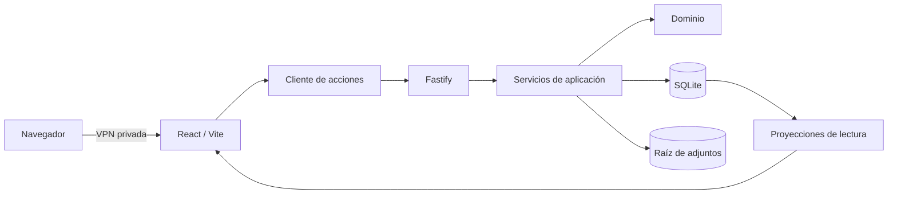

# Arquitectura del sistema de progresión gestionada

Esta carpeta descompone la arquitectura confirmada del MVP por responsabilidades. No sustituye la verdad de producto ni la especificación funcional:

1. [`PRODUCT.md`](../PRODUCT.md) contiene los hechos durables del producto.
2. [`MVP_SPEC.md`](../docs/MVP_SPEC.md) define alcance y aceptación funcional.
3. Los documentos de esta carpeta explican cómo separar y conectar las partes de la aplicación.

Si aparece una contradicción, se corrige primero la fuente de mayor autoridad y después sus documentos derivados.

## Estilo arquitectónico

El MVP será un **monolito modular** desplegado como una sola aplicación en la Raspberry Pi. React/Vite entrega el cliente; Fastify expone consultas y acciones; SQLite conserva el estado y el historial; los adjuntos viven en una raíz administrada del SSD.

Esta elección deriva de las restricciones confirmadas: un usuario, una Raspberry Pi, una sola base de datos y una conexión central que debe ser transaccional. Los módulos permanecen separados en código, pero no se convierten en microservicios.

## Índice

| Documento | Responsabilidad |
| --- | --- |
| [`01-system-overview.md`](01-system-overview.md) | Contexto, estilo, componentes y dependencias permitidas. |
| [`02-domain-model.md`](02-domain-model.md) | Entidades, relaciones, estados, eventos e invariantes. |
| [`03-data-storage.md`](03-data-storage.md) | SQLite, transacciones, archivos, revisiones, papelera y migraciones. |
| [`04-backend-actions-api.md`](04-backend-actions-api.md) | Módulos Fastify, acciones, consultas, errores e idempotencia. |
| [`05-command-engine.md`](05-command-engine.md) | Gramática `/`, análisis, confirmación, ejecución y paridad con UI. |
| [`06-frontend-shell.md`](06-frontend-shell.md) | Navegación global, paneles, estado cliente y adaptación móvil. |
| [`07-knowledge-module.md`](07-knowledge-module.md) | Notas, bloques, Markdown, carpetas, etiquetas y adjuntos. |
| [`08-graph-module.md`](08-graph-module.md) | Proyección del grafo, expansión, ciclos, filtros e interacción. |
| [`09-progress-module.md`](09-progress-module.md) | Categorías, focos, metas, micro-metas, temporizador y estadísticas. |
| [`10-deployment-operations.md`](10-deployment-operations.md) | Raspberry Pi, red privada, procesos, almacenamiento y recuperación. |
| [`11-quality-testing.md`](11-quality-testing.md) | Calidad, escala, pruebas y puertas de entrega. |

## Invariantes transversales

- UI y comandos invocan la misma acción de dominio.
- Cada mutación completa su cambio de estado y su evento histórico en una sola transacción.
- SQLite es la única fuente de verdad estructurada; el grafo, las estadísticas y Markdown son proyecciones.
- Solo una finalización explícita de micro-meta cambia el progreso.
- Texto pegado, archivos importados y bloques de código nunca ejecutan comandos.
- Las jerarquías de carpetas y etiquetas no admiten ciclos; el grafo semántico sí.
- La aplicación falla de forma cerrada cuando pierde la conexión con la Raspberry Pi: informa y bloquea escrituras.
- El MVP no promete recuperación ante pérdida física del único SSD.

## Decisiones abiertas

Las decisiones abiertas viven en [`MVP_SPEC.md`](../docs/MVP_SPEC.md#13-decisiones-operativas-abiertas). Ningún documento de arquitectura debe resolverlas por accidente.
